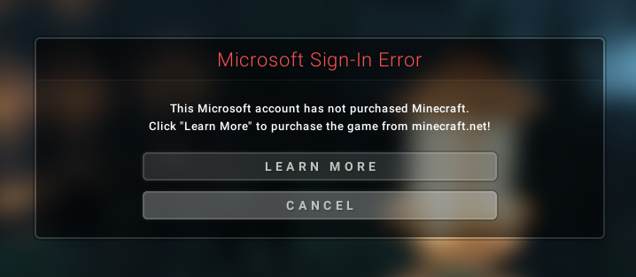
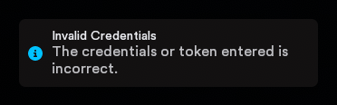

# [CrackedLunarAccount](https://github.com/EmaBixD/CrackedLunarAccount)
A tool to generate accounts compatible with the official Lunar Client by producing an `accounts.json` file you can drop into your Lunar Client settings.

## How it works  
Credits: based on work by <a href="https://github.com/Whatlify/CrackedLunarAccountTool?tab=readme-ov-file" title="Source" target="_blank">Whatlify</a>


Lunar Client does not perform any online authentication or license check against Microsoft servers when loading local account data.  
Instead, it simply reads the `accounts.json` file from your user directory and loads every entry it finds.  
Each entry contains several fields such as `localId`, `remoteId`, and `accessToken`, but Lunar Client does not verify whether these correspond to a real Microsoft account.  
This means any properly formatted UUID value can be used as a placeholder.  
The web generator automatically creates a valid JSON structure with those placeholder values, allowing the client to treat them as legitimate local accounts during startup.

## Getting started
1. Download and install the official Lunar Client from the <a href="https://www.lunarclient.com/download" title="Download Lunar" target="_blank">official download page</a>

2. Open my web <a href="https://emabixd.github.io/CrackedLunarAccount" title="Lunar Account Generator" target="_blank">account generator</a>
3. In the generator UI choose:
   - a **Username** (3–16 chars, letters/numbers/underscore), and  
   - either paste a **32-character UUID** (no dashes) or check **Auto-generate UUID** to create one.  
4. Click **Generate accounts.json** and review the output.  
5. Back up your existing Lunar Client `accounts.json` (if present).  
6. Replace the file at:
   - `Windows: C:\Users\%USERNAME%\.lunarclient\settings\game`
   - `macOS: ~/Users/$USER/.lunarclient/settings/game`
7. Restart Lunar Client.

#### Example `accounts.json` structure
<details>
  <summary><b> 📄 Click to view example <code>accounts.json</code></b></summary>
   
```json
{
  "activeAccountLocalId": "5da4ae0b6ee9417dae6841982f3a68ba",
  "accounts": {
    "5da4ae0b6ee9417dae6841982f3a68ba": {
      "accessToken": "5da4ae0b6ee9417dae6841982f3a68ba",
      "accessTokenExpiresAt": "2050-07-02T10:56:30.717167800Z",
      "eligibleForMigration": false,
      "hasMultipleProfiles": false,
      "legacy": true,
      "persistent": true,
      "userProperties": [],
      "localId": "5da4ae0b6ee9417dae6841982f3a68ba",
      "minecraftProfile": { "id": "5da4ae0b6ee9417dae6841982f3a68ba", "name": "ExampleName" },
      "remoteId": "5da4ae0b6ee9417dae6841982f3a68ba",
      "type": "Xbox",
      "username": "ExampleName"
    }
  }
}
```
</details>

## Notes
As of October 15, 2025 this method still works for Windows and macOS, though you may occasionally see a warning in the main menu and an in-game announcement every couple of minutes.

<p>
  
  &nbsp;&nbsp;&nbsp;&nbsp;&nbsp;
  
</p>

> *I'm already working on a way to avoid that...*

## ⚠ DISCLAIMER ⚠
Use of this information is at your own risk. The author assumes no responsibility for any consequences resulting from its use. Please respect the laws and act responsibly. ❗
